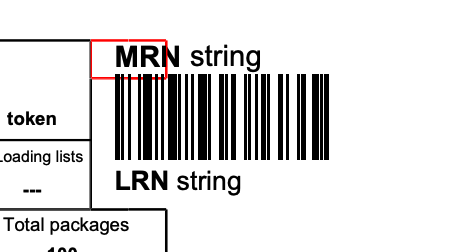
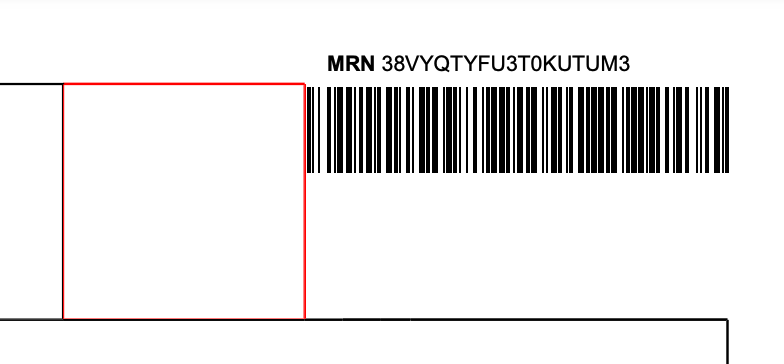

# transit-movements-trader-manage-documents

This is a service for generating PDFs for the following documents:
* TAD (Transit Accompanying Document)
* Unloading permission

## Download
In order to download these documents, submit the following messages through postman then download the document through the UI from the relevant view departures / view arrivals page:
* TAD
    * IE015
    * IE029
* Unloading permission
    * IE007
    * IE043

## Endpoints

---

## `GET /:departureId/transit-accompanying-document/:messageId`

### Successful response

#### 200 OK

* A call is made to the `GET` endpoint with:
  * a valid bearer token
  * a valid `HMRC-CTC-ORG` enrolment with `EoriNumber` identifier
  * an `APIVersion` header with `2.1` for final rules
* The IE015 message ID is retrieved for the given departure ID in the endpoint
* The IE015 message is retrieved for the given IE015 message ID (the IE015 is needed for certain data items that are not included in the IE029, like the limit date and supplementary units)
* The IE029 message is retrieved for the given IE029 message ID in the endpoint
* The response contains the generated PDF as a byte array

### Unsuccessful responses (with possible causes)

#### 400 BAD_REQUEST
* `APIVersion` header was missing

#### 401 UNAUTHORIZED
* A generic authorization error occurred. The likely cause of this is an invalid or missing bearer token.

#### 403 FORBIDDEN
* User has insufficient enrolments

#### 500 INTERNAL_SERVER_ERROR
* An error occurred retrieving the IE015 message ID
* An error occurred retrieving the IE015
* An error occurred retrieving the IE029
* An error occurred generating the PDF

---

## `GET /:arrivalId/unloading-permission-document/:messageId`

### Successful response

#### 200 OK

* A call is made to the `GET` endpoint with:
  * a valid bearer token
  * a valid `HMRC-CTC-ORG` enrolment with `EoriNumber` identifier
  * an `APIVersion` header with `2.1` for final rules
* The IE043 message is retrieved for the given arrival ID and IE043 message ID in the endpoint
* The response contains the generated PDF as a byte array

### Unsuccessful responses (with possible causes)

#### 400 BAD_REQUEST
* `APIVersion` header was missing

#### 401 UNAUTHORIZED
* A generic authorization error occurred. The likely cause of this is an invalid or missing bearer token.

#### 403 FORBIDDEN
* User has insufficient enrolments

#### 500 INTERNAL_SERVER_ERROR
* An error occurred retrieving the IE043
* An error occurred generating the PDF

---

## Development
Here is a list of logs that have been encountered during development and the likely causes:

| Error                                                                                                                                                                                | Cause                                                                                                                                                                                                                                                                                                                                | Fix                                                        |
|--------------------------------------------------------------------------------------------------------------------------------------------------------------------------------------|--------------------------------------------------------------------------------------------------------------------------------------------------------------------------------------------------------------------------------------------------------------------------------------------------------------------------------------|------------------------------------------------------------|
| `javax.xml.transform.TransformerException: org.xml.sax.SAXParseException; lineNumber: x; columnNumber: y; The processing instruction target matching "[xX][mM][lL]" is not allowed.` | There is likely a blank line above the `@template` in the `xxxDocument.scala.xml` file. This blank line seemingly introduces a BOM into the `XmlFormat.Appendable` which the PlayFop library is unable to parse.                                                                                                                     | Remove the blank line.                                     |
| `Cannot find LM to handle given FO for LengthBase. (fo:table-row, location: x:y)`                                                                                                    | LM corresponds to the Layout Manager. This log likely indicates a dimension (e.g. `width` and/or `height`) has been applied to a `table-row` as a percentage of something that PlayFop cannot determine.                                                                                                                             | Remove the dimension.                                      |
| `Cannot find LM to handle given FO for LengthBase. (fo:table-cell, location: x:y)`                                                                                                   | LM corresponds to the Layout Manager. This log likely indicates a dimension (e.g. `width` and/or `height`) has been applied to a `table-cell` as a percentage of something that PlayFop cannot determine.                                                                                                                            | Remove the dimension.                                      |
| `getContentAreaBPD called on unknown BPD`                                                                                                                                            | A dimension has been defined on a `block-container` (e.g. `width` and/or `height`) as a percentage of something that PlayFop cannot determine.                                                                                                                                                                                       | Remove the dimension.                                      |
| `Only a value of "auto" for block-progression-dimension has a well-specified behavior on fo:table. Falling back to "auto". (See position x:y)`                                       | A height has been defined on a `table`.                                                                                                                                                                                                                                                                                              | Remove the height.                                         |
| `The following feature isn't implemented by Apache FOP, yet: table-layout="auto" (on fo:table) (See position x:y)`                                                                   | A `table` is missing a `table-layout` attribute.                                                                                                                                                                                                                                                                                     | Add the `table-layout` attribute.                          |
| `Content overflows the viewport of an fo:block-container in block-progression direction by x millipoints. Content will be clipped.`                                                  | A dimension has been defined on a `block-container` (e.g. `width` and/or `height`) that is insufficient to house the content within.                                                                                                                                                                                                 | Remove the dimension.                                      |
| `The contents of fo:block line 1 exceed the available area in the inline-progression direction by x millipoints. (See position y:z)`                                                 | The content (in this case, the word 'MRN') spills over the border of the area it should be contained within. This could be due to hardcoded padding to force the content to look like it is in the correct place. The following image depicts this:  | Ensure the content is contained within the available area. |
| `The contents of fo:instream-foreign-object line 1 exceed the available area in the inline-progression direction by x millipoints. (See position y:z)`                               | The content (in this case, the barcode) spills over the border of the area it should be contained within. This could be due to hardcoded padding to force the content to look like it is in the correct place. The following image depicts this:     | Ensure the content is contained within the available area. |

It can be tricky to interpret where in the code the location/line number/column number refers to but generally speaking if you `println` the XML that gets generated in the PDF generator class and copy it to a text interpreter the line numbers should roughly align (expect an offset of one or two lines in some cases).

### License

This code is open source software licensed under the [Apache 2.0 License]("http://www.apache.org/licenses/LICENSE-2.0.html").
